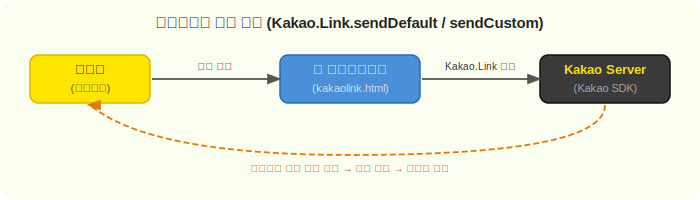
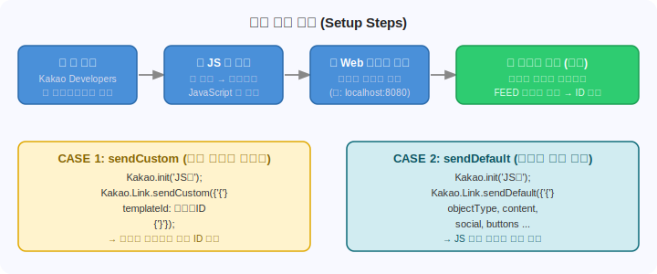

# Kakao Link - JavaScript 카카오링크 보내기

JavaScript SDK를 이용해서 웹에서 카카오톡으로 링크(메시지)를 공유하는 예제 프로젝트입니다.

---

## 파일 구조

```
kakaolink/
├── kakaolink.html     # 카카오링크 구현 샘플 HTML
├── images/
│   ├── flow-kakaolink.svg   # 동작 흐름 다이어그램
│   └── setup-steps.svg      # 셋업 단계 다이어그램
└── README.md
```

---

## 동작 흐름



사용자가 버튼을 클릭하면 `Kakao.Link` 함수가 호출되고, Kakao SDK가 카카오톡 공유 팝업을 띄워 줍니다. 친구를 선택하고 공유하기를 누르면 해당 친구의 카카오톡에 링크 메시지가 전달됩니다.

---

## 사전 준비 과정



### 1. Kakao Developers에 앱 등록

1. [Kakao Developers](https://developers.kakao.com/) 접속
2. **내 애플리케이션 → 애플리케이션 추가하기** 클릭
3. 앱 이름, 사업자명 입력 후 저장

### 2. JavaScript 키 확인

- 생성된 앱의 **앱 설정 → 요약정보** 페이지에서 **JavaScript 키** 확인
- 이 키를 코드의 `Kakao.init('여기에 입력')` 부분에 사용

### 3. Web 플랫폼 등록

- 앱 설정 → **플랫폼 → Web 플랫폼 등록**
- 사이트 도메인 입력 (로컬 테스트: `http://localhost:8080`)
- ⚠️ **카카오링크는 등록된 도메인에서만 동작**합니다. `file://`로 직접 열면 안 됩니다.

### 4. (CASE 1 전용) 메시지 템플릿 만들기

- 앱 설정 → **메시지 템플릿 도구** 접속
- 새 템플릿 만들기 → **FEED** 선택 → 확인
- 생성된 템플릿의 **ID** 값을 메모 (숫자)
- 이 ID를 코드의 `templateId: 여기에입력` 부분에 사용

---

## 🚀 사용 방법

### HTML 파일 실행

반드시 **로컬 서버**를 통해 실행해야 합니다. (예: VS Code Live Server, Python http.server 등)

```bash
# Python으로 간단하게 로컬 서버 실행
python -m http.server 8080
```

그 다음 브라우저에서 `http://localhost:8080/kakaolink.html` 접속

---

## 💻 코드 설명

```html
<script src="https://developers.kakao.com/sdk/js/kakao.min.js"></script>
<script>
    Kakao.init('자바스크립트 키');  // JS 키

    // CASE 1: 미리 만든 템플릿으로 보내기
    function sendLinkCustom() {
        Kakao.Link.sendCustom({
            templateId: 000000  //템플릿 아이디
        });
    }


    function sendLinkDefault() {
        Kakao.Link.sendDefault({
            objectType: 'feed',
            content: {
                title: '제목',
                description: '설명',
                imageUrl: '이미지 URL',
                link: {
                    mobileWebUrl: '링크 URL',
                    webUrl: '링크 URL',
                },
            },
            buttons: [
                {
                    title: '웹으로 보기',
                    link: { mobileWebUrl: '링크', webUrl: '링크' },
                },
            ],
        });
    }
</script>
```

| 방식 | 함수 | 설명 |
|------|------|------|
| CASE 1 | `sendCustom` | 템플릿 도구에서 미리 만든 FEED 템플릿 사용. templateId만 지정하면 됨 |
| CASE 2 | `sendDefault` | JS 코드 안에서 직접 content, buttons 등 정의. 템플릿 도구 불필요 |

---

## 주의사항

- `Kakao.init()`은 **한 번만** 호출해야 합니다. 중복 호출 시 에러 발생 가능
- 도메인이 Kakao Developers에 등록되어 있지 않으면 공유 팝업이 열리지 않음
- `templateId`는 **숫자** 타입으로 입력 (문자열 X)
- `Kakao.Link`는 구버전 SDK 방식이며, 신규 프로젝트는 `Kakao.Share` API 사용 권장

---

## 참고 링크

- [Kakao Developers 공식 문서](https://developers.kakao.com/docs/latest/ko/message/js-link)
- [카카오 메시지 템플릿 가이드](https://developers.kakao.com/docs/latest/ko/message/message-template)
