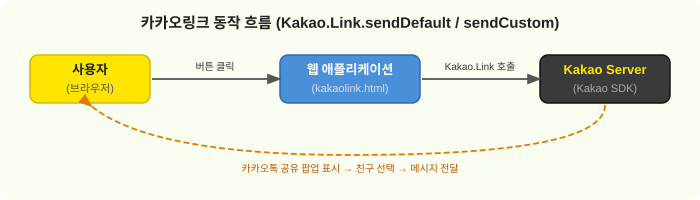

# KakaoTalk Share - JavaScript 카카오톡 공유

JavaScript SDK를 이용해 웹에서 **카카오톡으로 링크 및 메시지를 공유하는 예제 프로젝트**입니다.

카카오 공식 JavaScript SDK의 최신 `Kakao.Share` API를 사용합니다.

---

## 파일 구조

```text
kakaolink/
├── kakaolink.html        # 카카오톡 공유 구현 샘플 HTML
├── images/
│   ├── flow-kakaolink.svg
│   └── setup-steps.svg
└── README.md
```

---

## 동작 흐름



사용자가 웹페이지의 공유 버튼을 클릭하면 `Kakao.Share` API가 호출됩니다.

이후 카카오톡 공유 화면이 열리고, 사용자가 친구 또는 채팅방을 직접 선택해 메시지를 공유할 수 있습니다.

```text
사용자
  ↓
공유 버튼 클릭
  ↓
Kakao.Share 호출
  ↓
카카오톡 공유 화면
  ↓
친구 / 채팅방 선택
  ↓
메시지 공유
```

> 카카오톡 공유 API는 서비스가 특정 사용자에게 메시지를 자동으로 보내는 기능이 아닙니다.
> 사용자가 직접 공유 대상을 선택하고 메시지를 전송하는 방식입니다.

---

# 사전 준비

## 1. Kakao Developers 앱 등록

1. [Kakao Developers](https://developers.kakao.com/)에 접속
2. **내 애플리케이션**으로 이동
3. **애플리케이션 추가하기** 선택
4. 앱 이름 등 필요한 정보를 입력
5. 앱 생성

---

## 2. JavaScript 키 확인

생성한 애플리케이션에서 **JavaScript 키**를 확인합니다.

확인한 JavaScript 키는 SDK 초기화에 사용합니다.

```javascript
Kakao.init('YOUR_JAVASCRIPT_KEY');
```

예:

```javascript
Kakao.init('0123456789abcdef0123456789abcdef');
```

> JavaScript 키는 REST API 키, Native App 키, Admin 키와 다릅니다.
> 웹 JavaScript SDK에서는 **JavaScript 키**를 사용해야 합니다.

---

## 3. JavaScript SDK 도메인 등록

카카오 JavaScript SDK를 사용할 웹사이트의 도메인을 앱에 등록해야 합니다.

Kakao Developers의 앱 설정에서 **JavaScript SDK 도메인**을 등록합니다.

로컬 개발 환경이라면 예를 들어 다음과 같이 등록할 수 있습니다.

### VS Code Live Server

```text
http://localhost:5500
```

### Python HTTP Server

```text
http://localhost:8080
```

실제 웹사이트에서 사용하는 경우 실제 서비스 도메인을 등록합니다.

```text
https://example.com
```

> 등록하지 않은 도메인에서는 JavaScript SDK의 카카오톡 공유 기능이 정상적으로 동작하지 않을 수 있습니다.

---

## 4. 제품 링크 관리 설정

카카오톡 공유 메시지에서 사용할 웹 링크의 도메인도 앱 설정에 등록되어 있어야 합니다.

예를 들어 다음 링크를 메시지에서 사용한다면

```text
https://example.com/post/123
```

앱의 **제품 링크 관리 → 웹 도메인**에 해당 서비스 도메인을 등록합니다.

```text
https://example.com
```

---

## 5. 사용자 정의 템플릿 만들기

> 이 단계는 `Kakao.Share.sendCustom()`을 사용할 경우에만 필요합니다.

Kakao Developers에서

**도구 → 메시지 템플릿**

으로 이동합니다.

1. 사용할 앱 선택
2. 메시지 템플릿 생성
3. 원하는 템플릿 구성
4. 저장
5. 생성된 **템플릿 ID** 확인

템플릿 ID는 JavaScript에서 다음과 같이 사용합니다.

```javascript
Kakao.Share.sendCustom({
    templateId: 12345
});
```

`templateId`에는 자신이 생성한 실제 템플릿 ID를 입력합니다.

---

# 카카오 로그인은 필요한가?

**카카오톡 공유 기능만 사용하는 경우 카카오 로그인은 필요하지 않습니다.**

`Kakao.Share.sendDefault()`와 `Kakao.Share.sendCustom()`은 사용자가 직접 친구나 채팅방을 선택해 공유하는 기능이므로 별도의 카카오 로그인이나 메시지 전송 동의항목이 필요하지 않습니다.

카카오 로그인과 `talk_message` 동의항목이 필요한 **카카오톡 메시지 API**와 혼동하지 않도록 주의하세요.

두 기능은 서로 다릅니다.

| 기능       | 카카오톡 공유       | 카카오톡 메시지              |
| -------- | ------------- | --------------------- |
| API      | `Kakao.Share` | KakaoTalk Message API |
| 공유 대상 선택 | 사용자가 직접 선택    | API에서 메시지 발송          |
| 카카오 로그인  | 필요 없음         | 필요                    |
| 메시지 동의항목 | 필요 없음         | 필요                    |
| 주요 용도    | 콘텐츠 공유 버튼     | 사용자 메시지 기능            |

---

# 사용 방법

HTML 파일을 `file://` 방식으로 직접 실행하지 말고 웹 서버를 통해 실행하는 것을 권장합니다.

## Python으로 실행

프로젝트 폴더에서 다음 명령어를 실행합니다.

```bash
python -m http.server 8080
```

이후 브라우저에서

```text
http://localhost:8080/kakaolink.html
```

에 접속합니다.

---

## VS Code Live Server

VS Code의 **Live Server** 확장을 사용하는 경우 HTML 파일에서

```text
Open with Live Server
```

를 실행합니다.

일반적으로 다음과 같은 주소가 사용됩니다.

```text
http://localhost:5500/kakaolink.html
```

실제 포트는 Live Server 설정에 따라 달라질 수 있습니다.

---

# JavaScript SDK 불러오기

HTML에서 Kakao JavaScript SDK를 불러옵니다.

```html
<script
  src="https://t1.kakaocdn.net/kakao_js_sdk/2.7.6/kakao.min.js"
  integrity="sha384-WAtVcQYcmTO/N+C1N+1m6Gp8qxh+3NlnP7X1U7qP6P5dQY/MJUHBgv7Uqj0IKv6k"
  crossorigin="anonymous"
></script>
```

> SDK 버전 및 무결성 값은 변경될 수 있으므로 실제 프로젝트에서는 Kakao Developers의 최신 JavaScript SDK 설치 문서를 확인하는 것을 권장합니다.

SDK를 불러온 뒤 JavaScript 키로 초기화합니다.

```javascript
Kakao.init('YOUR_JAVASCRIPT_KEY');
```

초기화 여부는 다음과 같이 확인할 수 있습니다.

```javascript
console.log(Kakao.isInitialized());
```

정상적으로 초기화되었다면

```text
true
```

가 출력됩니다.

---

# CASE 1 - 사용자 정의 템플릿으로 공유

Kakao Developers의 **메시지 템플릿 도구**에서 미리 만든 템플릿을 사용하는 방식입니다.

```javascript
function sendLinkCustom() {
    Kakao.Share.sendCustom({
        templateId: 12345
    });
}
```

`12345` 부분을 실제 템플릿 ID로 변경합니다.

HTML 버튼과 연결하면 다음과 같습니다.

```html
<button onclick="sendLinkCustom()">
    카카오톡 공유
</button>
```

---

# CASE 2 - JavaScript에서 직접 메시지 구성

별도의 사용자 정의 템플릿을 만들지 않고 JavaScript 코드 안에서 메시지를 구성할 수도 있습니다.

```javascript
function sendLinkDefault() {
    Kakao.Share.sendDefault({
        objectType: 'feed',

        content: {
            title: '제목',
            description: '설명',

            imageUrl: 'https://example.com/image.jpg',

            link: {
                mobileWebUrl: 'https://example.com',
                webUrl: 'https://example.com'
            }
        },

        buttons: [
            {
                title: '웹으로 보기',

                link: {
                    mobileWebUrl: 'https://example.com',
                    webUrl: 'https://example.com'
                }
            }
        ]
    });
}
```

HTML:

```html
<button onclick="sendLinkDefault()">
    카카오톡 공유
</button>
```

---

# 전체 예제

```html
<!DOCTYPE html>
<html lang="ko">
<head>
    <meta charset="UTF-8">

    <meta
        name="viewport"
        content="width=device-width, initial-scale=1.0"
    >

    <title>KakaoTalk Share Example</title>
</head>

<body>

    <h1>KakaoTalk Share</h1>

    <button onclick="sendLinkCustom()">
        사용자 정의 템플릿 공유
    </button>

    <button onclick="sendLinkDefault()">
        기본 템플릿 공유
    </button>


    <!-- Kakao JavaScript SDK -->
    <script
        src="https://t1.kakaocdn.net/kakao_js_sdk/2.7.6/kakao.min.js"
        integrity="sha384-WAtVcQYcmTO/N+C1N+1m6Gp8qxh+3NlnP7X1U7qP6P5dQY/MJUHBgv7Uqj0IKv6k"
        crossorigin="anonymous"
    ></script>


    <script>

        // Kakao JavaScript SDK 초기화
        Kakao.init('YOUR_JAVASCRIPT_KEY');

        console.log(
            'Kakao SDK initialized:',
            Kakao.isInitialized()
        );


        // CASE 1
        // 사용자 정의 템플릿

        function sendLinkCustom() {

            Kakao.Share.sendCustom({
                templateId: 12345
            });

        }


        // CASE 2
        // 기본 템플릿

        function sendLinkDefault() {

            Kakao.Share.sendDefault({

                objectType: 'feed',

                content: {

                    title: 'KakaoTalk Share 테스트',

                    description:
                        'JavaScript SDK를 사용한 카카오톡 공유 예제입니다.',

                    imageUrl:
                        'https://example.com/image.jpg',

                    link: {

                        mobileWebUrl:
                            'https://example.com',

                        webUrl:
                            'https://example.com'

                    }

                },

                buttons: [

                    {

                        title: '웹으로 보기',

                        link: {

                            mobileWebUrl:
                                'https://example.com',

                            webUrl:
                                'https://example.com'

                        }

                    }

                ]

            });

        }

    </script>

</body>
</html>
```

---

# `sendDefault`와 `sendCustom` 차이

| 방식     | 함수                          | 설명                               |
| ------ | --------------------------- | -------------------------------- |
| CASE 1 | `Kakao.Share.sendCustom()`  | 메시지 템플릿 도구에서 미리 만든 사용자 정의 템플릿 사용 |
| CASE 2 | `Kakao.Share.sendDefault()` | JavaScript 코드에서 메시지를 직접 구성       |
| CASE 3 | `Kakao.Share.sendScrap()`   | 웹 페이지 정보를 스크랩하여 메시지 구성           |

---

# SDK가 버튼을 직접 생성하게 하기

직접 `onclick` 이벤트를 만들지 않고 Kakao SDK가 공유 버튼의 이벤트를 설정하도록 할 수도 있습니다.

기본 템플릿:

```javascript
Kakao.Share.createDefaultButton({
    container: '#kakaotalk-share-btn',

    objectType: 'feed',

    content: {
        title: '제목',
        description: '설명',

        imageUrl: 'https://example.com/image.jpg',

        link: {
            mobileWebUrl: 'https://example.com',
            webUrl: 'https://example.com'
        }
    }
});
```

HTML:

```html
<button id="kakaotalk-share-btn">
    카카오톡 공유
</button>
```

사용자 정의 템플릿의 경우

```javascript
Kakao.Share.createCustomButton({
    container: '#kakaotalk-share-btn',
    templateId: 12345
});
```

를 사용할 수 있습니다.

---

# 스크랩 공유

웹 페이지의 정보를 기반으로 메시지를 생성하려면 `sendScrap()`을 사용할 수 있습니다.

```javascript
Kakao.Share.sendScrap({
    requestUrl: 'https://example.com'
});
```

`requestUrl`에 사용되는 웹사이트 도메인은 앱의 **제품 링크 관리 → 웹 도메인**에 등록되어 있어야 합니다.

---

# 주의사항

* 최신 JavaScript SDK에서는 `Kakao.Link` 대신 **`Kakao.Share`**를 사용합니다.
* `Kakao.init()`은 페이지에서 한 번만 실행하는 것을 권장합니다.
* 반드시 자신의 앱의 **JavaScript 키**를 사용하세요.
* 웹사이트의 도메인을 **JavaScript SDK 도메인**에 등록해야 합니다.
* 메시지에서 사용하는 링크의 도메인도 **제품 링크 관리** 설정을 확인하세요.
* `sendCustom()`을 사용하려면 메시지 템플릿을 먼저 만들어야 합니다.
* `templateId`에는 실제 생성된 템플릿 ID를 입력해야 합니다.
* 카카오톡 공유 기능 자체에는 **카카오 로그인이 필요하지 않습니다.**
* 카카오톡 공유 기능 자체에는 **카카오톡 메시지 전송 동의항목이 필요하지 않습니다.**
* 사용자가 카카오톡 공유 화면에서 직접 친구 또는 채팅방을 선택해 전송합니다.
* 카카오 SDK와 API 사양은 변경될 수 있으므로 최신 공식 문서를 확인하세요.

---

# `Kakao.Link`에서 마이그레이션

과거 JavaScript SDK에서는 다음과 같은 코드를 사용했습니다.

```javascript
Kakao.Link.sendDefault(...)
```

```javascript
Kakao.Link.sendCustom(...)
```

현재는 `Kakao.Share` 모듈을 사용합니다.

```javascript
Kakao.Share.sendDefault(...)
```

```javascript
Kakao.Share.sendCustom(...)
```

JavaScript SDK 1.43.0부터 카카오톡 공유 모듈명이 `Kakao.Share`로 변경되었습니다.

기존 프로젝트를 사용하는 경우 `Kakao.Link` 관련 코드를 `Kakao.Share` 방식으로 변경하는 것을 권장합니다.

---

# 공식 문서

* [카카오톡 공유 JavaScript](https://developers.kakao.com/docs/ko/kakaotalk-share/js-link)
* [카카오톡 공유 이해하기](https://developers.kakao.com/docs/ko/kakaotalk-share/common)
* [메시지 템플릿 이해하기](https://developers.kakao.com/docs/ko/message-template/common)
* [기본 템플릿](https://developers.kakao.com/docs/ko/message-template/default)
* [사용자 정의 템플릿](https://developers.kakao.com/docs/ko/message-template/custom)
* [Kakao Developers](https://developers.kakao.com/)

---

## 참고

이 프로젝트는 카카오의 공식 JavaScript SDK를 이용한 학습 및 구현 예제입니다.

Kakao 및 KakaoTalk은 Kakao Corp.의 상표 또는 서비스입니다.
